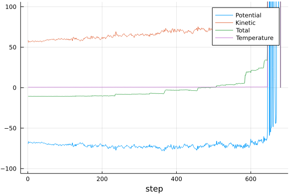
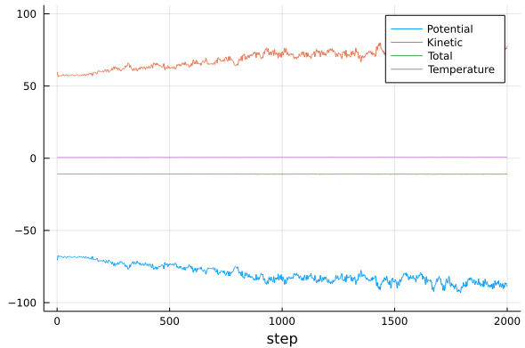

# Simulação de Dinâmica Molecular Microcanônica

Abra o arquivo [md-simple.jl](https://github.com/m3g/FundamentosDMC.jl/blob/master/src/md-simple.jl), que contém o algoritmo de simulação. A simulação começa com velocidades aleatórias, ajustadas para a média termodinâmica desejada de 0.6 unidades/átomo ($kT=0.6$ em um sistema bidimensional). A essa energia cinética média chamaremos de "temperatura".
O algoritmo de integração é Velocity-Verlet, que consiste em propagar as posições com

$\vec{x}(t+\Delta t) = \vec{x}(t) + \vec{v}(t)\Delta t + \frac{1}{2}\vec{a}(t)\Delta t^2$

sendo $\vec{a}(t)=\vec{F}(t)/m$, onde $\vec{F}(t)$ é a força no tempo corrente.
A força em seguida é calculada em um tempo posterior com

$\vec{F}(t+\Delta t) = -\nabla V\left[\vec{x}(t)\right]$

e então as velocidades no instante seguinte são calculadas com

$\vec{v}(t+\Delta t) = \vec{v}(t) +
\frac{1}{2}\left[
\frac{\vec{F}(t)}{m}+\frac{\vec{F}(t+\Delta t)}{m}\right]$

completando o ciclo. Neste exemplo as massas são consideradas unitárias, para simplificar. A simulação é executada por `nsteps` passos, com passo de integração $\Delta t$, este sendo um parâmetro de entrada, `dt`, definido em `Options`.

A simulação não tem controle de temperatura ou de pressão. É uma propagação da trajetória segundo as leis de Newton, que deveriam conservar a energia. A isso se chama uma simulação "microcanônica", ou "NVE" (que conserva, em princípio, o número de partículas, o volume e a energia total).

## 3.1. Passo de integração

Para realizar uma MD simples, com um passo de integração de `dt=1.0`, execute o comando:
```julia-repl
julia> out = md(sys,Options(dt=0.1));
```
Em princípio, está previsto realizar 2000 passos de integração das equações de movimento. Teste passos de integração entre `1.0` e `0.01`.
Veja o que acontece com a energia. Veja o que acontece com a energia cinética média, que foi inicializada em 0.6 unidades/átomo. Discuta a escolha do passo de integração, e os valores de energia cinética obtidos. As simulações seguintes vão usar um passo de integração `dt = 0.05`.

É possível controlar a frequência de impressão e o número de pontos salvos no arquivo de trajetória com as opções `iprint` e `iprintxyz`:
```julia-repl
julia> out = md(sys,Options(dt=0.1,iprint=1,iprintxyz=5))
```
O número total de passos é controlado pelo parâmetro `nsteps`.

A variável `out` que sai da simulação é uma matriz com as energias e a temperatura em cada passo da simulação. É provável que a simulação "exploda" com passos de tempo grandes. Para visualizar esse processo, podemos fazer:
```julia-repl
julia> using Plots

julia> plot(
          out,ylim=[-100,100],
          label=["Potential" "Kinetic" "Total" "Temperature"],
          xlabel="step"
       )
```

E obteremos um gráfico semelhante a:
```@raw html
<center> 

</center>
```

Para passos de tempo menores a simulação deve conseguir chegar até o fim. Podemos ver o resultado novamente, e deve ser algo semelhante a:
```@raw html
<center> 

</center>
```

Observe e tente entender as amplitudes das oscilações das energias cinética e potencial, e as amplitudes das oscilações da energia total. A que se devem cada uma das oscilações? Veja como essas oscilações dependem do passo de integração.

## 3.2. Visualização da trajetória

Por fim, abra a trajetória usando VMD. Não é necessário sair da seção do `Julia`. Ao pressionar `;` (ponto e vírgula) aparecerá um prompt `shell>`, a partir do qual é possível executar o `VMD`, se este estiver instalado corretamente e disponível no `path`:

```julia-repl
shell> vmd traj.xyz
```
Dentro do VMD, escolha a representação `VDW`, em
```
Graphics -> Representations -> Drawing Method -> VDW
```
e dê o comando
```
vmd> pbc set { 100. 100. 100. } -all
```
para indicar a periodicidade do sistema.
Para representar explicitamente o sistema periódico, escolha `+X;+Y;-X;-Y` em
```
Graphics -> Representations -> Periodic
```

Para sair do `VMD` use o comando `exit`, e para voltar ao prompt do `Julia` a partir do `shell>`, use `backspace`.

## 3.3. Código completo resumido

```julia
using FundamentosDMC, Plots

sys = System(n=100)
minimize!(sys)
out = md(sys,Options(dt=0.05))

plot(out,ylim=[-100,100],
    label=["Potential" "Kinetic" "Total" "Temperature"],
    xlabel="step"
)
```

O arquivo `traj.xyz` é gerado e pode ser visualizado no `VMD`.
